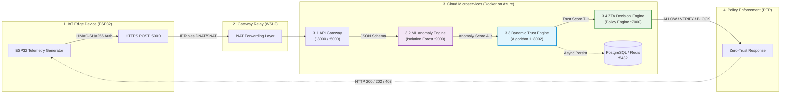

# Continuous Zero-Trust Calibration for Edge-IoT

[](https://opensource.org/licenses/MIT)
[](https://www.python.org/)
[](https://www.docker.com/)
[](https://doi.org/10.1109/ACCESS.2022.3165421)
[]()

> **Official Implementation** for the research paper:  
> *"Continuous Zero-Trust Calibration for Edge-IoT: Closed-Form Trust Dynamics and Asymmetric Slow-Burn Attack Detection"*  
> **Authors:** Shreyas A, Arun Kumar B R

---

## 📌 Overview

Conventional Zero-Trust Architecture (ZTA) implementations in IoT rely on **stateless, per-packet anomaly verdicts**. This makes them structurally blind to **slow-burn adversaries**—attackers who deliberately pace malicious requests below the static detection threshold ($A_t < A_{\text{thr}}$) to evade detection while accumulating damage.

This repository provides an end-to-end, containerized, and mathematically grounded **Dynamic Trust Engine** that wraps any underlying point anomaly classifier with:
1. **$O(1)$ Asymmetric Slow-Burn Accumulator:** Tracks smoothed anomaly energy ($E_t$) against an empirical margin ($\gamma = 0.035$) with an $11\times$ accumulation-to-decay asymmetry ($\lambda=0.55 \gg \delta=0.05$).
2. **Closed-Form Asymptotic Trust Recovery ($\alpha$):** Analytically derives the recovery coefficient from high-level security policy targets without heuristic gain-tuning (Theorem 1).
3. **Multiplicative Attack Decay:** Immediately degrades trust proportional to anomaly magnitude ($T_{t+1} = T_t(1 - A_t)$) for overt volumetric attacks.
4. **Deterministic Auditability:** Logs a two-level mathematical trace ($\text{Formula ID}, E_t, SB_t, T_t, \text{State Transition}, \text{Reason String}$) for every single request at zero computational overhead.

---

## 🏛️ System Architecture



---

## 📊 Key Benchmark Results (Edge-IIoTset)

Evaluated on **$332{,}881$ test samples** from the realistic [Edge-IIoTset](https://doi.org/10.1109/ACCESS.2022.3165421) cybersecurity benchmark across 15 classes:

| Metric / Evaluation Component | Static Baseline (Isolation Forest) | Dynamic Trust Engine (Ours) | Advantage |
|:---|:---:|:---:|:---|
| **Slow-Burn Attack Detection Rate** | `0.0%` (0/100 missed) | **`100.0%` (100/100 detected)** | **+100% detection coverage** |
| **Mean Detection Delay** | $\infty$ (Never detected) | **$4.40 \pm 0.60$ steps** | **Near-immediate containment** |
| **Per-Sample Accuracy** | `92.92%` | **`92.92%` (Unchanged)** | **Zero classification penalty** |
| **Per-Sample F1-Score** | `96.22%` | **`96.22%` (Unchanged)** | **Optimal sensitivity** |
| **Normal Traffic Dormancy** | N/A | **Proven Dormant ($\mu_{\text{normal}} < \gamma$)** | **No false policy triggers** |
| **Per-Device Memory Overhead** | $O(1)$ | **$O(1)$ (6 scalar floats $\approx 48$ bytes)** | **Fits on edge microcontrollers** |

---

## 📁 Repository Structure

```text
.
├── dynamic-trust-engine/          # Core Dynamic Trust Engine & Mathematical Models
│   ├── config/                    # Trust parameter configurations (alpha, gamma, theta)
│   ├── docker/                    # Dockerfile & Docker-compose for Trust Engine
│   ├── journal_plots/             # High-resolution benchmark trajectory figures
│   ├── src/
│   │   ├── trust_math/            # Formulations: alpha derivation, decay, EMA, state machine
│   │   ├── trust_engine.py        # Implementation of Algorithm 1
│   │   ├── trust_api.py           # FastAPI REST microservice endpoint (:8002)
│   │   └── trust_storage.py       # Persistence layer (PostgreSQL / Redis)
│   └── tests/                     # Unit & mathematical property tests
│
├── edge-iiot-anomaly-detection/   # ML Anomaly Detection Pipeline (Isolation Forest)
│   ├── artifacts/                 # Serialized model (.pkl), metadata & generated plots
│   ├── config/                    # Preprocessing & tuning hyperparameters
│   ├── src/                       # Data loader, cleaner, scaler, feature engineering
│   ├── train.py                   # Optuna-tuned Isolation Forest training pipeline
│   └── tests/                     # Pipeline validation tests
│
├── zero-trust-engine/             # Policy Decision Point (PDP) Microservice
│   ├── config/policy.yaml         # Multi-state threshold boundaries (ALLOW, VERIFY, BLOCK)
│   ├── docker/                    # PDP container configs (:7000)
│   └── src/                       # Rule execution & forensic decision logging
│
├── .gitignore
├── LICENSE                        # MIT License
└── README.md
```

---

## ⚡ Quickstart & Reproduction

### 1. Prerequisites
- Python 3.10 or higher
- Docker & Docker Compose (optional, for full microservice orchestration)

### 2. Clone the Repository
```bash
git clone https://github.com/shreyas23dev/Continuous-Zero-Trust-Calibration-for-Edge-IoT.git
cd Continuous-Zero-Trust-Calibration-for-Edge-IoT
```

### 3. Setup Virtual Environment
```bash
python -m venv venv
# On Linux/macOS:
source venv/bin/activate
# On Windows:
.\venv\Scripts\activate

# Install dependencies:
pip install -r edge-iiot-anomaly-detection/requirements.txt
pip install -r dynamic-trust-engine/requirements.txt
```

---

## 🧪 Running Benchmarks & Demonstrations

### Run Step-by-Step Scenario Trajectories
Replay real Edge-IIoTset test samples through both the ML Anomaly Detector and the Dynamic Trust Engine:
```bash
# Execute representative scenario validation:
python edge-iiot-anomaly-detection/train.py
```

### Run Mathematical Unit Tests
Verify the numerical bounds, monotonicity, and closed-form recovery guarantees:
```bash
pytest dynamic-trust-engine/tests/
```

### Launch Full Microservice Stack (Docker)
To run the complete 4-container zero-trust pipeline locally:
```bash
cd zero-trust-engine/docker
docker compose up -d
```

---

## 📐 Mathematical Formulation Summary

### 1. Multiplicative Attack Decay
$$\boxed{T_{t+1} = T_t (1 - A_t), \quad \text{for } A_t \ge A_{\text{thr}}}$$

### 2. Closed-Form Asymptotic Recovery (Theorem 1)
$$\boxed{\alpha = 1 - (1 - T_{\text{target}})^{1/k}}$$

### 3. Asymmetric Slow-Burn Accumulator
$$\boxed{SB_{t+1} = \begin{cases} SB_t + \lambda, & \text{if } E_{t+1} > \gamma \\ \max(0, SB_t - \delta), & \text{otherwise} \end{cases}}$$

---

## 📄 Citation

If you use this codebase, models, or theoretical formulations in your research, please cite:

```bibtex
@article{shreyas2026continuous,
  title={Continuous Zero-Trust Calibration for Edge-IoT: Closed-Form Trust Dynamics and Asymmetric Slow-Burn Attack Detection},
  author={Shreyas, A. and Arun Kumar, B. R.},
  journal={Computers \& Security},
  year={2026},
  publisher={Elsevier},
  note={Under Review}
}
```

---

## 📜 License

This project is licensed under the **MIT License** - see the [LICENSE](LICENSE) file for details.
